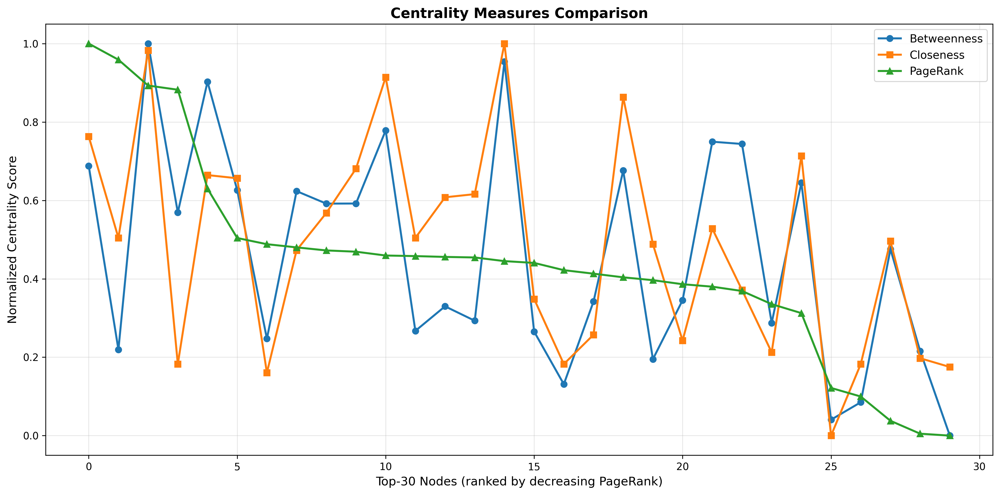
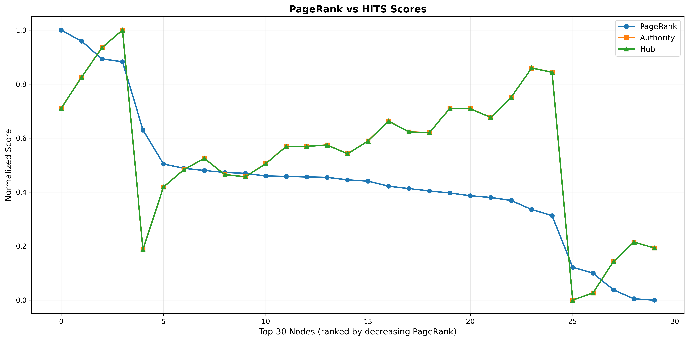

# Project 2: SNAP Network Analysis

**Name:** Michail Theofanopoulos\
**ΑΜ:** p3352401\
**Course:** Social Network Analysis\
**Date:** December 2025

---

## Part 1: Euler Paths and Circuits

### Implementation

Implemented two functions to detect Euler paths and circuits in undirected graphs:

- **Euler Path:** A graph has an Euler path if it's connected and has exactly 2 vertices with odd degree.
- **Euler Circuit:** A graph has an Euler circuit if it's connected and all vertices have even degree.

### Test Cases

**Test 1: Linear path (0-1-2-3-4)**

- Has Euler path (2 odd-degree vertices: 0 and 4)
- No Euler circuit (not all vertices have even degree)

**Test 2: Star graph (center connected to 4 leaves)**

- No Euler path (4 odd-degree vertices, not exactly 2)

**Test 3: Large cycle graph (1000 nodes)**

- Has Euler circuit (all vertices have degree 2, connected in a cycle)

**Test 4: Linear path (same as Test 1)**

- No Euler circuit (has odd-degree vertices)

All tests pass successfully.

---

## Part 2: Centrality and Community Detection

### Parameters

Generated Watts-Strogatz graphs with:

- Out-degree: 10
- Rewiring probability: 0.1
- Sizes: 50, 500 nodes

### Results

| Nodes | Edges | Max Deg Node | Degree | Top Hub | Hub Score | Top Auth | Auth Score | GN Time | CNM Time |
|-------|-------|--------------|--------|---------|-----------|----------|------------|---------|----------|
| 50 | 500 | 23 | 18 | 18 | 0.142424 | 18 | 0.142424 | 0.50s | 0.00s |
| 500 | 5000 | 42 | 22 | 307 | 0.045020 | 307 | 0.045020 | TIMEOUT (622s) | 0.02s |

### Algorithm Suitability

**Q1: Medium enterprise (50 employees)?**

Both algorithms work fine. GN takes 0.5s, CNM is near-instant.

**Q2: Google NY (18,000 employees)?**

Only CNM is suitable. GN already times out at 500 nodes (more than 10 minutes), so it would take forever for 18K nodes. CNM scales much better and should complete in a few seconds.

**Q3: Facebook (1 billion users)?**

Neither algorithm is practical. Even CNM would struggle with memory and computation time at this scale. Would need distributed computing and specialized algorithms.

### PageRank Analysis

Generated plots for top-30 PageRank nodes from the 500-node graph.

**Plot 1: Betweenness, Closeness, PageRank**

PageRank and closeness are strongly correlated - both measure how central a node is. Betweenness shows more variation since it measures how often a node appears on shortest paths between other nodes.

**Plot 2: PageRank, Authority, Hub**

PageRank and authority scores are well-aligned. Hub and authority scores are identical in undirected graphs, which is why the lines overlap. All three metrics agree on which nodes are most important in the network.

### Observations

- Girvan-Newman is too slow for anything beyond small graphs
- CNM is much faster and scales better
- In small-world networks, different centrality measures generally agree on important nodes
- The plots show that top-ranked nodes by PageRank also tend to be central by other measures
