# Image Classification with Deep Learning Project Report

**Institution:** Athens University of Economics and Business
**Course:** Deep Learning
**Authors:** 
1. Michail Theofanopoulos p3352401
2. Georgios Kitsakis p3352406

---

## Project 1 - Image Classification on Fashion-MNIST & CIFAR-10

### 1.1 Introduction

In the first part of this project we analyze how different neural network architectures affect image classification performance. We started from the simplest possible model (a plain MLP) and worked our way up to a custom ResNet, training each one on two standard benchmarks: **Fashion-MNIST** and **CIFAR-10**.

Fashion-MNIST contains 70,000 grayscale 28x28 images of clothing items across 10 categories. It's relatively easy since images are centered, clean and low-resolution. CIFAR-10 contains 60,000 color 32x32 images of real-world objects (cars, birds, cats, etc.) and is significantly harder due to the variety of backgrounds, angles and lighting.

By testing every model on both datasets, we can see which architectural improvements actually matter and how much harder real-world images are compared to clean benchmarks.

The figure below shows random samples from both datasets to illustrate the difference in complexity.

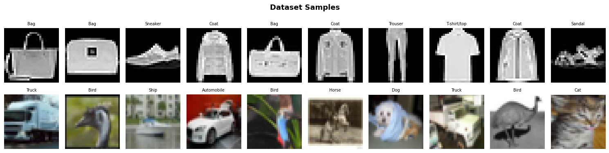

> **Figure 1:** Random samples from Fashion-MNIST (top row, grayscale) and CIFAR-10 (bottom row, color)

### 1.2 Shared Setup

All models were trained with the same configuration to keep comparisons fair:
- **Optimizer:** Adam (lr = 1e-3)
- **Loss:** Sparse Categorical Crossentropy
- **Epochs:** 20 (with EarlyStopping, patience = 3)
- **Batch size:** 64
- **Seeds:** Fixed (42) for reproducibility

Pixel values were normalized to [0,1]. No external data or pre-trained weights were used and everything was trained from scratch.

### 1.3 Model Architectures

#### Model 1 - MLP (Baseline)

Our baseline is a simple Multi-Layer-Perceptron. It flattens the image into a 1D vector and passes it through Dense layers (512 -> 256 -> 128) with BatchNormalization and Dropout. The output is a Softmax over 10 classes.

The key limitation here is that flattening destroys all spatial structure. The model has no idea which pixels are neighbors and treats the image as a bag of numbers. This works okay on simple datasets but falls apart when spatial relationships matter.

#### Model 2 - Simple CNN

The first CNN uses two convolutional blocks: Conv2D(32) -> MaxPool, then Conv2D(64) -> MaxPool, followed by a Dense(128) head with Dropout(0.4). This is about as simple as a CNN can get.

Even this basic architecture is a huge step up from the MLP because convolutions preserve spatial structure. Filters slide across the image and detect local patterns (edges, corners, textures) regardless of where they appear. MaxPooling then compresses the spatial dimensions while keeping the strongest activations.

#### Model 3 - Deep CNN (VGG-style)

We went deeper by stacking two convolutions per block before each pooling step, following the VGG design philosophy. Three blocks (32 -> 64 -> 128 filters), each with double Conv2D layers, BatchNorm, MaxPool and increasing Dropout (0.2 -> 0.3 -> 0.4). The head uses Flatten -> Dense(256) -> softmax.

The double convolutions per block let the network learn more complex patterns at each spatial scale before downsampling. Adding BatchNorm and progressive Dropout helped control the overfitting that comes with more parameters.

#### Model 4 - Deep CNN v2

This refines the Deep CNN with two changes: doubled filter sizes (64 -> 128 -> 256) and **GlobalAveragePooling** instead of Flatten. We also moved BatchNorm before the activation (Conv -> BN -> ReLU pattern), which is considered best practice in model architectures.

GlobalAveragePooling was the bigger improvement since instead of flattening the final feature maps into a huge vector (which creates thousands of parameters and is prone to overfitting), GAP averages each feature map into a single number. This dramatically reduces the parameter count in the classifier head.

#### Model 5 - CNN with Data Augmentation

Same architecture as Deep CNN v2, but with an augmentation pipeline baked into the model: RandomFlip (horizontal), RandomRotation (0.05) and RandomZoom (0.05). These transformations are applied on-the-fly during training only.

The idea is simple. By showing the model slightly different versions of each image every epoch, it's forced to learn features that are robust to position, orientation and scale, rather than memorizing specific pixel arrangements. We kept the augmentation mild (5% rotation/zoom) to avoid distorting the images too much.

#### Model 6 - ResNet from Scratch

The most complex model we built. It uses **residual blocks** where each block computes F(x) + x — the output of two convolutions added to the original input via a skip connection. If the filter count changes, a 1x1 convolution adjusts the shortcut dimensions.

The architecture has an entry Conv2D(64) block, then two residual blocks at 64 filters, two at 128 (with a stride-2 MaxPool between) and GlobalAveragePooling into the Dense head.

Skip connections solve the vanishing gradient problem that plagues deep networks. Without them, gradients shrink as they backpropagate through many layers and the early layers barely learn. With skip connections, gradients have a direct path back and the network only needs to learn the residual (the difference from the identity), which is easier to optimize.

### 1.4 Results

| Model | Fashion-MNIST | CIFAR-10 |
|---|---|---|
| MLP | 88.48% | 50.72% |
| Simple CNN | 92.44% | 71.66% |
| Deep CNN | 93.14% | 83.94% |
| Deep CNN v2 | 94.35% | 89.32% |
| CNN + Augmentation | 94.19% | 88.44% |
| ResNet from Scratch | **94.49%** | **89.40%** |

The bar chart below shows this comparison visually. The blue bars (Fashion-MNIST) stay relatively flat across models while the orange bars (CIFAR-10) grow dramatically as architectures get more sophisticated.

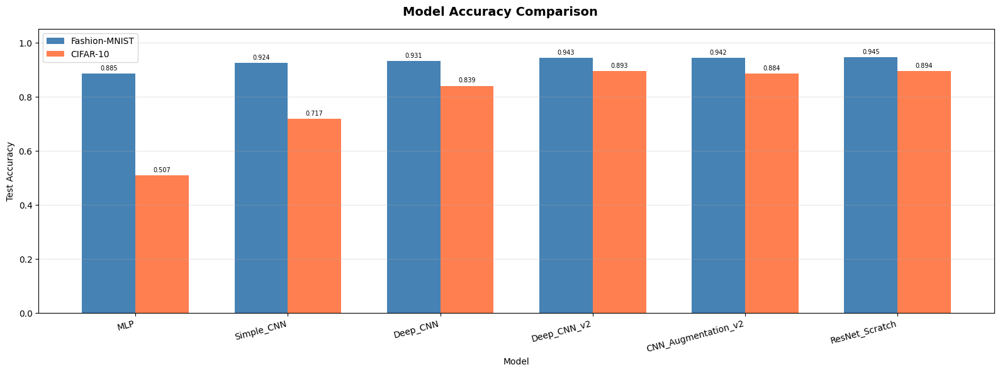

> **Figure 2:** Model accuracy comparison bar chart — all 6 models on both datasets

### 1.5 Learning Curves

The training history plots show accuracy and loss over epochs for each model. Simpler models (MLP, Simple CNN) overfit early — training accuracy keeps climbing while validation accuracy plateaus or drops. The deeper models with regularization show a much smaller train/val gap, indicating better generalization.

A few things stand out in the curves:
- The **MLP on CIFAR-10** barely learns at all — validation accuracy flatlines around 50%
- **Deep CNN v2** and **ResNet** converge fastest and most smoothly
- The **augmented model** trains more slowly (as expected: augmentation makes training harder) but its validation loss is the lowest of all models

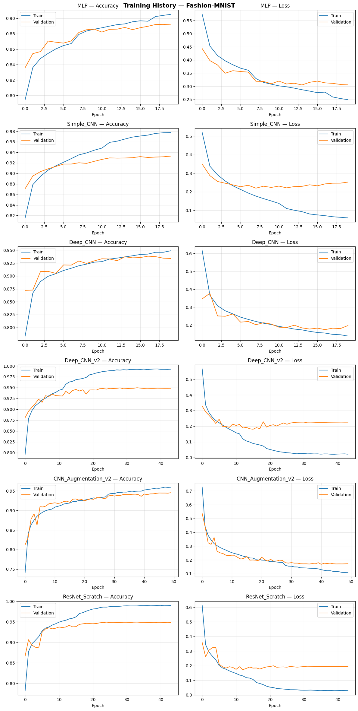

> **Figure 3:** Training and validation accuracy/loss curves for all models on Fashion-MNIST

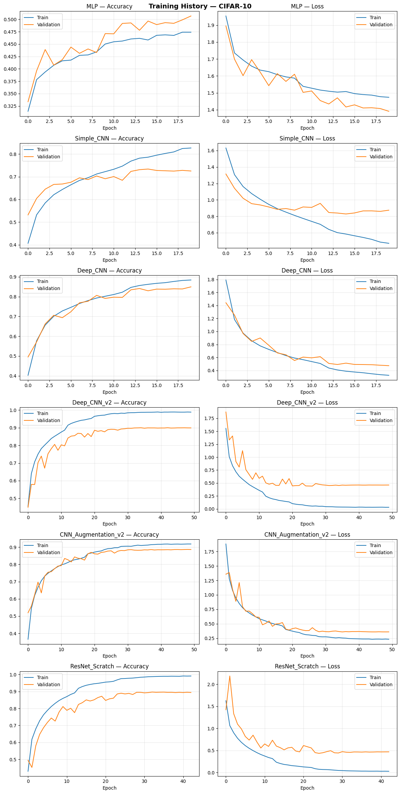

> **Figure 4:** Training and validation accuracy/loss curves for all models on CIFAR-10

### 1.6 Error Analysis — Failed Predictions

For each model, we plotted 10 misclassified images to understand what types of mistakes the models make.

Common failure patterns:
- On **Fashion-MNIST**, most errors involve visually similar categories (e.g. Shirt vs T-shirt, Pullover vs Coat). Even humans would struggle with some of these
- On **CIFAR-10**, the MLP and Simple CNN fail on cluttered backgrounds and unusual angles. The deeper models mostly fail on genuinely ambiguous images (e.g. a blurry photo where a cat and dog look similar)
- As models get more complex, the remaining errors shift from "obvious mistakes" to "genuinely hard cases" — a good sign that the models are learning meaningful features

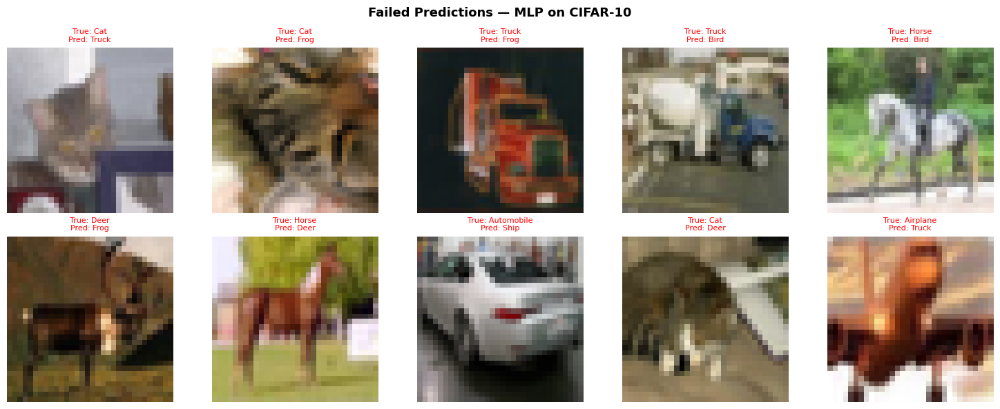

> **Figure 5:** Failed predictions for MLP on CIFAR-10

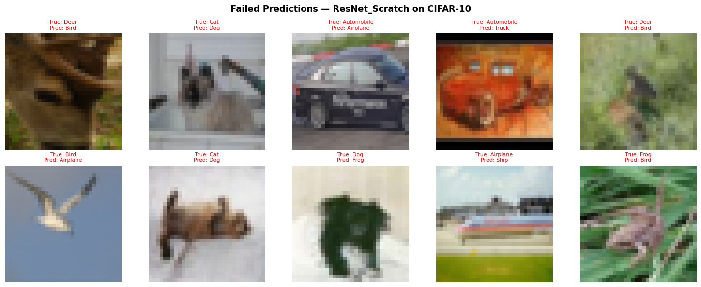

> **Figure 6:** Failed predictions for ResNet on CIFAR-10

### 1.7 Analysis

The results tell a clear story. On Fashion-MNIST, even the MLP gets 88% and the gap between models is small (88%–94%). The dataset is just too easy — grayscale, centered, low-res — so even simple models do well.

CIFAR-10 is where the architectural choices really show. The MLP gets barely above random (50.7% for 10 classes), because flattening a color image into a vector is hopeless when objects can appear anywhere with any background. The Simple CNN jumps to 71.6% just by using convolutions and each subsequent improvement pushes the number higher.

The biggest single jump was from Simple CNN to Deep CNN (+12% on CIFAR-10), showing that depth matters a lot for complex images. The second biggest was from Deep CNN to Deep CNN v2 (+5.4%), largely thanks to GlobalAveragePooling reducing overfitting.

Data augmentation actually scored slightly lower than Deep CNN v2 in raw accuracy, which surprised us. Looking at the loss values though, the augmented model had the lowest test loss of all models (0.37 vs 0.47), meaning its predictions were better calibrated and it was less overconfident when wrong. This is a useful property in practice, even if accuracy is marginally lower.

ResNet from Scratch topped both datasets, but by a thin margin over Deep CNN v2 on CIFAR-10 (89.4% vs 89.3%). The skip connections helped most with training stability rather than a dramatic accuracy boost at this model size.

> *Full code and outputs: [image-classification-project.ipynb](https://colab.research.google.com/drive/18hHEAUN3k3zfLP3D_FshVxiaJznUZr4E?usp=sharing)*

---

## Project 2 - MURA X-Ray Classification

### 2.1 Introduction

The second part of the project shifts from toy benchmarks to a real medical problem. We are given X-ray images of bones (shoulder, elbow, wrist, hand, finger, forearm, humerus) and we need to automatically decide whether each image is **normal** or **abnormal**.

This is a **binary classification** task. The model outputs a single number between 0 and 1. Close to 0 means it thinks the X-ray looks normal. Close to 1 means it suspects something is wrong.

We use the **MURA dataset** (MUsculoskeletal RAdiographs), created by Stanford University. It contains around 40,000 X-ray images already split into ~36,800 training images and ~3,200 validation images, each labeled by a radiologist.

The project is split across two notebooks:

| Notebook | Models | Author |
|---|---|---|
| Notebook 1 | Custom CNN, DenseNet121 | Michail Theofanopoulos |
| Notebook 2 | EfficientNetB0, Dual-Backbone Fusion (MobileNetV2 + EfficientNetB0) | Georgios Kitsakis |

---

### 2.2 Notebook 1

#### 2.2.1 Setup

**GPU & Mixed Precision:** We enable `mixed_float16` in TensorFlow. This makes the GPU use 16-bit float for most computations instead of 32-bit, cutting memory usage roughly in half and speeding up training without meaningfully affecting accuracy since critical operations (like loss computation) stay in 32-bit.

**Key configuration:**
- Image size: 224 × 224
- Batch size: 64
- Max epochs: 30

To get a feel for the data, below are some sample images from the dataset. Even to the untrained eye, the variety is obvious — different body parts, different angles, different levels of contrast. Some abnormalities are clearly visible (a bright spot, an unusual bone shape), while others look almost identical to normal images. This gives an early intuition for why the task is hard: the differences between normal and abnormal can be extremely subtle.

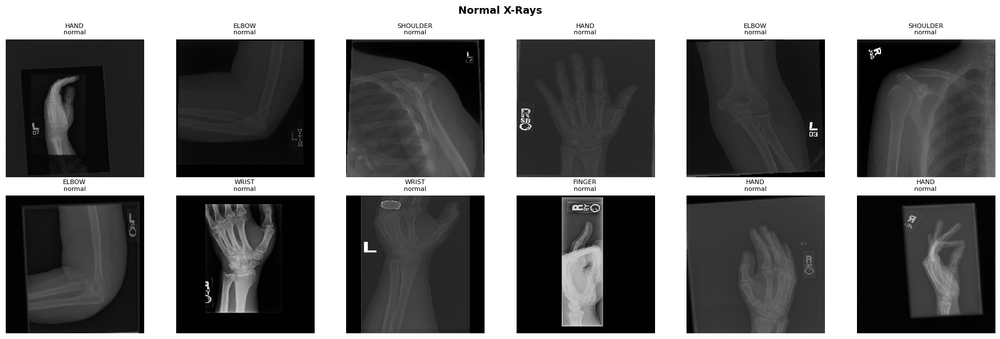
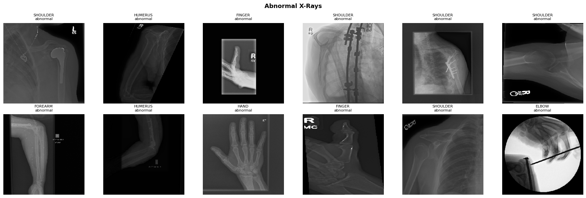

---

#### 2.2.2 Data Loading

The MURA dataset provides CSV files mapping every image path to its label. We read them and build a single DataFrame with columns: `image_path`, `label`, `set_type`, `category`. After parsing, we have:
- Training: 36,808 images
- Validation: 3,197 images
- 7 body part categories

---

#### 2.2.3 Class Imbalance

The dataset is not balanced since there are ~23,600 normal images and ~16,400 abnormal images, roughly a 60/40 split.

This is a real problem. A model that always predicts "normal" would get 60% accuracy without learning anything useful. In medicine, this is especially dangerous since a false negative means a patient with a real problem is sent home.

We handle it with **class weights**:
- Normal (class 0): weight = 1.0
- Abnormal (class 1): weight = **2.0**

This tells the loss function to penalise mistakes on abnormal images **twice as much**. The model pays more attention to the minority class even though it sees it less often.

#### 2.2.4 Data Augmentation

Training images are transformed randomly on-the-fly:

| Augmentation | Value | Why |
|---|---|---|
| Horizontal flip | On | X-rays can be mirrored based on patient positioning |
| Rotation | ±15° | Patients are not always perfectly aligned |
| Zoom | ±15% | Accounts for different distances from the X-ray source |
| Width/height shift | ±10% | Off-center positioning |
| Brightness | 0.8 – 1.2 | Simulates different X-ray exposure levels |
| Shear | 5% | Minor geometric distortion |

None of this is applied to validation images. Those are only rescaled to [0,1] so evaluation reflects real-world conditions.

---

#### 2.2.5 Data Pipeline

We use Keras `ImageDataGenerator` to load images from disk in batches of 64, applying augmentation on training images only. This avoids loading all 40,000 images into RAM at once.

We also implemented a `tf.data.Dataset` alternative pipeline that uses TensorFlow's built-in parallelism (`AUTOTUNE`) to load and preprocess images on the CPU while the GPU is training.

---

#### 2.2.6 Model 1 - Custom CNN (Baseline)

The first model is built entirely from scratch. No external knowledge, no pre-trained weights. It has to learn everything about X-rays from our 36,800 training images alone.

**Architecture:**
```
Input: 224 × 224 × 3
Block 1: Conv2D(32)  → BatchNorm → MaxPool(2×2) → Dropout(0.25) → 112×112×32
Block 2: Conv2D(64)  → BatchNorm → MaxPool(2×2) → Dropout(0.25) →  56×56×64
Block 3: Conv2D(128) → BatchNorm → MaxPool(2×2) → Dropout(0.25) →  28×28×128
Block 4: Conv2D(256) → BatchNorm → MaxPool(2×2) → Dropout(0.25) →  14×14×256
GlobalAveragePooling → 256 values
Dense(256, ReLU) → Dropout(0.4) → Dense(1, Sigmoid)
```

**Design choices and why:**

The filters double at each block (32 -> 64 -> 128 -> 256). Early layers detect simple things: edges, gradients, brightness transitions. Deeper layers combine those into more complex patterns: bone contours, density changes, fracture lines. More filters at deeper levels gives the network capacity to represent increasingly complex features.

**GlobalAveragePooling** instead of Flatten: after the 4th block the feature maps are 14×14×256. Flattening that gives 14×14×256 = 50,176 numbers going into the Dense layer, which is expensive and prone to overfitting. GAP instead averages each 14×14 map into a single number, giving 256 values in total. It's asking "how strongly was this feature present anywhere in the image?" rather than tracking exact positions.

**Total parameters:** ~456,000 (1.74MB) — a small model.

**Training:**
- Optimizer: Adam, lr = 0.001
- Loss: Binary cross-entropy
- Class weights: {0: 1.0, 1: 2.0}
- EarlyStopping: patience = 5, restores best weights
- ReduceLROnPlateau: halves lr when val_loss stalls for 3 epochs
- ModelCheckpoint: saves best model to disk
- **Stopped at epoch 18**

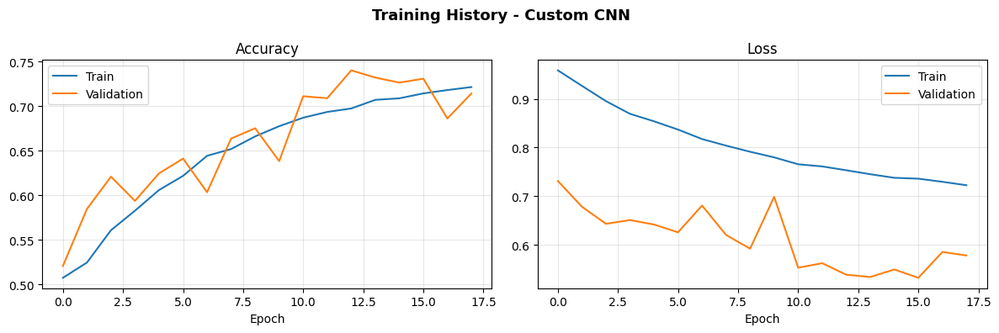

> **Figure 1:** Custom CNN — training and validation accuracy/loss curves

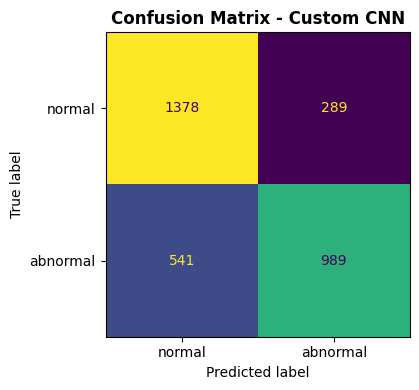

> **Figure 2:** Custom CNN — confusion matrix on validation set

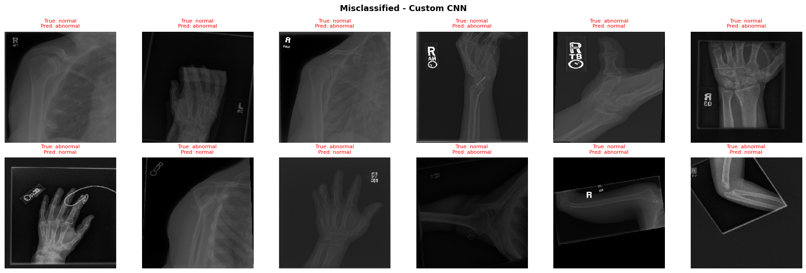

> **Figure 3:** Custom CNN — misclassified examples

**Results:**

| Metric | Value |
|---|---|
| Val Accuracy | **74.04%** |
| Val Loss | 0.5384 |
| Precision (Normal) | 0.72 |
| Recall (Normal) | 0.83 |
| F1 (Normal) | 0.77 |
| Precision (Abnormal) | 0.77 |
| Recall (Abnormal) | **0.65** |
| F1 (Abnormal) | 0.70 |

The model catches 83% of normal images but only **65% of abnormals** — it misses about 1 in 3 pathologies. The class weights helped, but a model learning from scratch on 37K images simply doesn't have enough signal to reliably detect subtle abnormalities in medical images.

---

#### 2.2.7 Model 2 - DenseNet121 (Transfer Learning)

Instead of learning from scratch, we load a **DenseNet121 already trained on ImageNet** — a dataset of 1.2 million everyday photos. It has never seen an X-ray, but it already understands how to detect edges, textures, gradients and shapes. We take all of that and point it at X-rays.

**Why DenseNet121 specifically?** Stanford's original MURA paper used DenseNet as their primary model. DenseNet's key innovation is **dense connectivity** where every layer receives the output of every previous layer as input. This gives extremely strong gradient flow (the error signal can reach early layers easily) and efficient feature reuse (later layers don't need to relearn what early layers already detected).

**Architecture:**
```
DenseNet121 (ImageNet weights, no top, global avg pooling) → 1024 values
Dense(256, ReLU) → Dropout(0.4) → Dense(1, Sigmoid)
```

The DenseNet base produces a 1024-dimensional summary of the image. Our head then maps that to a single probability.

**Preprocessing:** DenseNet121 expects a specific normalization — channel-wise mean subtraction based on ImageNet statistics — not a simple division by 255. Using the wrong preprocessing would give the model pixel values it has never encountered during its original training.

**Two-phase training:**

**Phase 1 — Train the head only (5 epochs, lr = 0.001):**
All 121 DenseNet layers are frozen. Only our new Dense(256) head trains. This is necessary because the head starts with random weights. If we unfroze everything immediately, the random gradients from the head would ripple back and destroy the ImageNet features before the head has learned anything useful. We warm up the head first.

**Phase 2 — Fine-tune everything (up to 30 epochs, lr = 3e-5):**
All layers are unfrozen. The entire network trains end-to-end at a very small learning rate. 3e-5 is about 33× smaller than Phase 1. This lets the pre-trained features adapt gently toward X-ray patterns without catastrophic forgetting — where the model overwrites what it learned on ImageNet and becomes worse.

Training details for Phase 2:
- EarlyStopping: patience = 8, restores best weights
- ReduceLROnPlateau: halves lr when val_loss stalls for 5 epochs
- ModelCheckpoint: saves best model
- **Stopped at epoch 16**

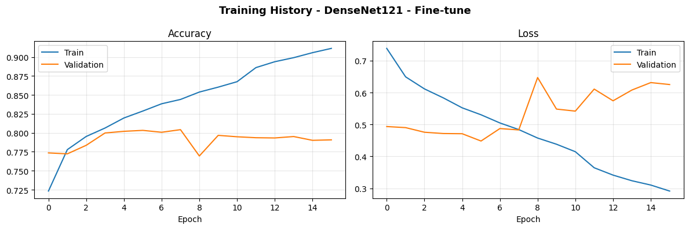

> **Figure 4:** DenseNet121 — Phase 2 training curves

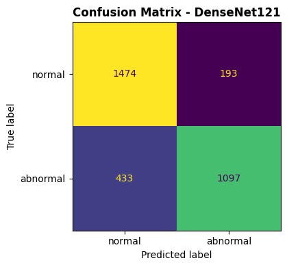

> **Figure 5:** DenseNet121 — confusion matrix on validation set

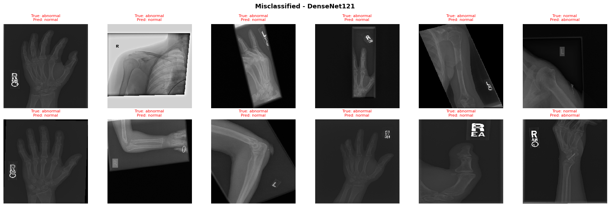

> **Figure 6:** DenseNet121 — misclassified examples

**Results:**

| Metric | Value |
|---|---|
| Val Accuracy | **80.42%** |
| Val Loss | 0.4829 |
| Precision (Normal) | 0.77 |
| Recall (Normal) | 0.88 |
| F1 (Normal) | 0.82 |
| Precision (Abnormal) | 0.85 |
| Recall (Abnormal) | **0.72** |
| F1 (Abnormal) | 0.78 |

A significant jump across every metric. Most importantly, recall on abnormals improved from 65% to **72%** — the model now catches 7% more pathologies. That translates directly to fewer patients sent home with an undetected problem.

---

#### 2.2.8 Comparison — Custom CNN vs DenseNet121

| Metric | Custom CNN | DenseNet121 | Δ |
|---|---|---|---|
| Val Accuracy | 74.04% | **80.42%** | +6.38% |
| Val Loss | 0.5384 | **0.4829** | -0.055 |
| F1 (Normal) | 0.77 | **0.82** | +0.05 |
| F1 (Abnormal) | 0.70 | **0.78** | +0.08 |
| Recall (Abnormal) | 64.6% | **71.7%** | +7.1% |
| Precision (Abnormal) | 77.4% | **85.0%** | +7.6% |
| Epochs Trained | 18 | 16 | — |

Transfer learning wins on every metric. The custom CNN had to learn what an edge is, what bone texture looks like, what density contrast means — all from 37K images. DenseNet already understood all of that from 1.2 million images and just needed to apply it to a new domain. The 6.4% accuracy gap and the 7% recall gap on abnormals are the direct consequence of that difference.

> *Full code and outputs for Notebook 1: [fork-of-mura-classification.ipynb](https://colab.research.google.com/drive/1V8I5eKVr1zfw-ErsOgOXiMQxUCmUqePa?usp=sharing)*

---

### 2.3 Notebook 2

#### 2.3.1 Setup

**GPU & Mixed Precision:** Same GPU setup as Notebook 1 (Tesla P100-PCIE-16GB). Mixed precision (`mixed_float16`) is enabled for Models 3's data loading phase but **disabled (switched to `float32`) before fine-tuning**. This is important — `mixed_float16` can destabilise gradient updates during fine-tuning of pretrained models, so we switch back to full precision before training begins.

**Key configuration:**
- Image size: 224 × 224
- Batch size: 64
- Max epochs: 30

---

#### 2.3.2 Data Loading & Preprocessing

Same data loading pipeline as Notebook 1 — CSV files parsed into a DataFrame with `image_path`, `label`, `set_type`, `category`. Same class weights (`{0: 1.0, 1: 2.0}`) and same augmentation strategy.

For Model 3 (EfficientNetB0), we use EfficientNet's own preprocessing function (`eff_preprocess`) instead of simple `/255` rescaling. For the fine-tuning phase, we switch to a `tf.data.Dataset` pipeline with parallel loading (`AUTOTUNE`) for speed.

For Model 4 (Dual-Backbone Fusion), we use an averaged preprocessing — the mean of EfficientNet and MobileNetV2 preprocessing — since both backbones share the same input.

---

#### 2.3.3 Model 3 - EfficientNetB0 (Transfer Learning)

**What makes EfficientNet different from DenseNet?**
DenseNet scales by adding more layers with dense connections. EfficientNet instead uses **compound scaling** — it scales depth, width, and input resolution together in a mathematically optimal ratio. This means EfficientNetB0 achieves competitive accuracy with significantly fewer parameters than DenseNet121.

**Architecture:**
```
EfficientNetB0 (ImageNet weights, no top, global avg pooling) → 1280 values
Dense(256, ReLU, L2 regularization) → Dropout(0.5) → Dense(1, Sigmoid)
```

We add L2 regularization (`1e-4`) to the head to reduce overfitting since the head trains with a relatively high learning rate in Phase 1.

**Two-phase training:**

**Phase 1 — Frozen base, head only (up to 10 epochs, lr = 0.001):**
All EfficientNetB0 layers frozen. Only the Dense head trains. EarlyStopping with patience=5 — stopped at epoch 6 (best val_accuracy: 76.04%).

**Phase 2 — Partial unfreeze + cosine LR decay (up to 30 epochs):**
Instead of unfreezing all 239 layers at once, we unfreeze only the **last 30 layers**. Early layers (edges, textures, basic shapes) are already perfect for any image task — we only need to adapt the high-level feature detectors.

We use **cosine decay** instead of ReduceLROnPlateau: the learning rate smoothly decreases from 3e-5 to near zero following a cosine curve. This avoids the abrupt drops of ReduceLROnPlateau and helps the model converge more smoothly.

- EarlyStopping: patience = 8
- ModelCheckpoint: saves best model

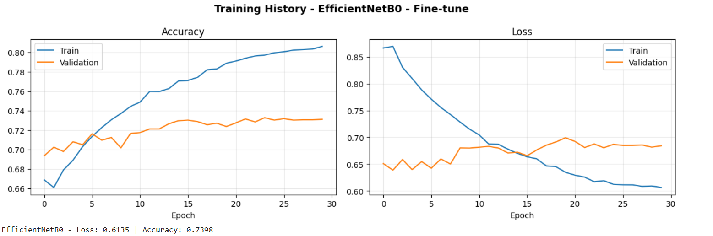

> **Figure 7:** EfficientNetB0 — Phase 2 fine-tuning curves

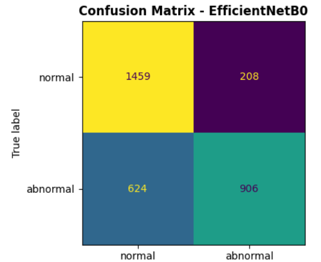

> **Figure 8:** EfficientNetB0 — confusion matrix on validation set

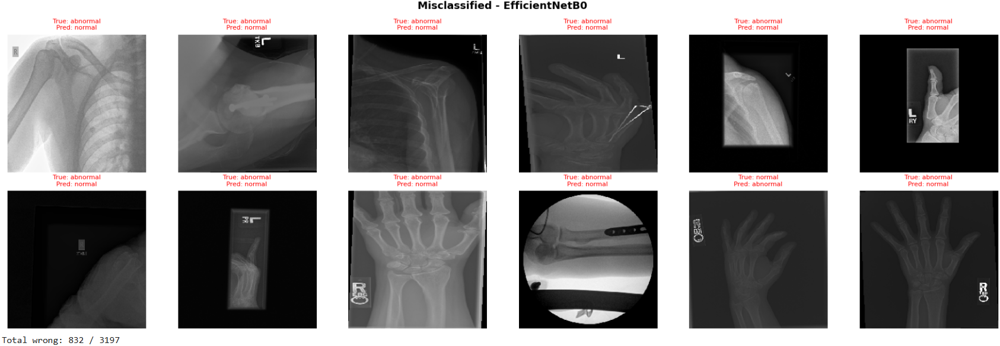

> **Figure 9:** EfficientNetB0 — misclassified examples

**Results:**

| Metric | Value |
|---|---|
| Val Accuracy | **73.98%** |
| Val Loss | 0.6138 |
| Precision (Normal) | 0.70 |
| Recall (Normal) | 0.87 |
| F1 (Normal) | 0.78 |
| Precision (Abnormal) | 0.81 |
| Recall (Abnormal) | **0.60** |
| F1 (Abnormal) | 0.69 |
| Epochs trained | 30 |

EfficientNetB0 reached 73.98% — slightly below DenseNet121 (80.42%). The recall on abnormals (60%) is the main weakness. The model is conservative — it predicts normal too often. This is likely because the cosine LR decay with only 30 layers unfrozen was too cautious; more aggressive fine-tuning would likely improve recall on the minority class.

---

#### 2.3.4 Model 4 - Dual-Backbone Fusion (MobileNetV2 + EfficientNetB0)

The most complex model in this project. Instead of using a single pretrained backbone, we run **two backbones in parallel** on the same image and combine their feature vectors before classification.

**Motivation:**
Each backbone has been trained differently and extracts different feature representations. MobileNetV2 uses **inverted residual blocks with linear bottlenecks** — designed for efficiency, it learns compact representations. EfficientNetB0 uses **compound scaling** — deeper, wider, and trained at higher resolution. Their feature sets are complementary: what one misses, the other might catch. Concatenating both gives the classifier a richer, more diverse description of each image.

**Architecture:**
```
Input image (224 × 224 × 3)
       |                    |
MobileNetV2 (frozen)    EfficientNetB0 (frozen)
GlobalAvgPool           GlobalAvgPool
→ 1280-dim              → 1280-dim
       |                    |
       Concatenate → 2560-dim
       BatchNormalization
       Dense(256, ReLU, L2=1e-4)
       Dropout(0.4)
       Dense(1, Sigmoid)
```

**Preprocessing:** Since both backbones share one input, we use the average of their respective preprocessing functions. This is a reasonable approximation that keeps pixel values in a range both backbones can handle.

**Two-phase training:**

**Phase 1 — Both backbones frozen, head only (up to 10 epochs, lr = 0.001):**
Only the fusion head (BatchNorm + Dense + Dropout) trains. EarlyStopping patience=5.

**Phase 2 — Last 30 layers of each backbone unfrozen (up to 30 epochs):**
We unfreeze the last 30 layers of both MobileNetV2 and EfficientNetB0 simultaneously. Cosine LR decay from 3e-5 to near zero. This lets both backbones adapt their high-level features toward X-ray patterns while preserving the low-level ImageNet features.

- EarlyStopping: patience = 8
- ModelCheckpoint: saves best model

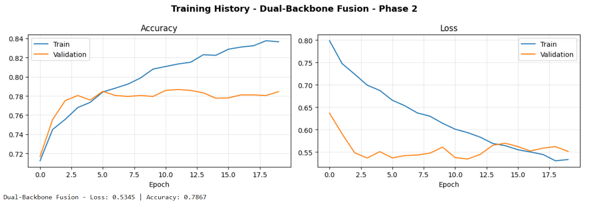

> **Figure 10:** Dual-Backbone Fusion — Phase 2 fine-tuning curves

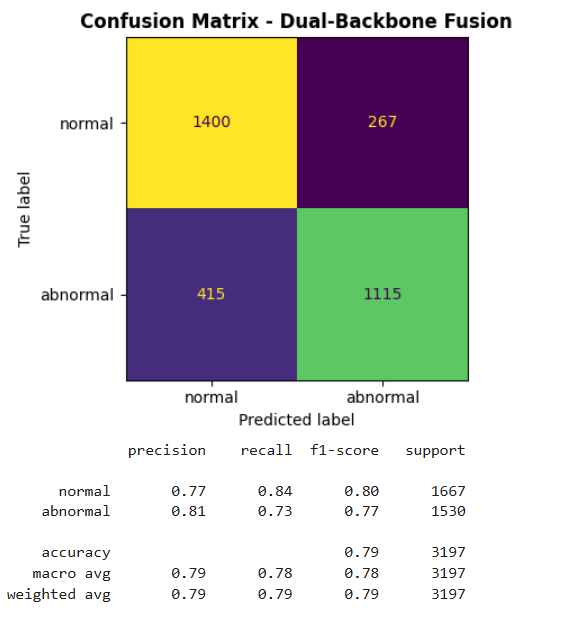

> **Figure 11:** Dual-Backbone Fusion — confusion matrix on validation set

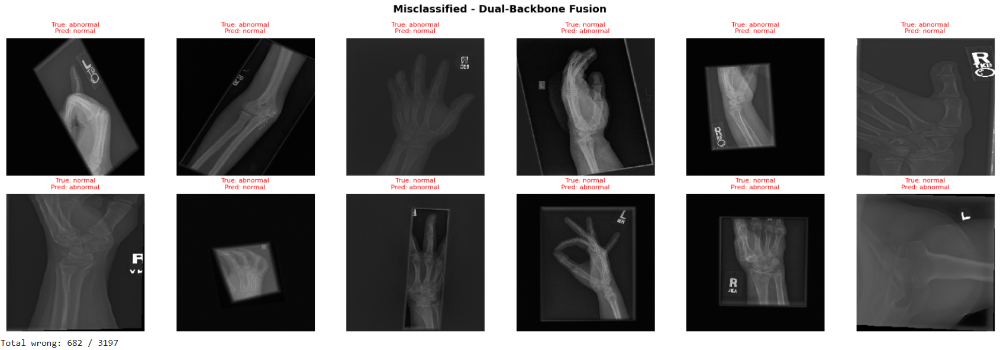

> **Figure 12:** Dual-Backbone Fusion — misclassified examples

**Results:**

| Metric | Value |
|---|---|
| Val Accuracy | **78.67%** |
| Val Loss | 0.5345 |

The Dual-Backbone Fusion significantly outperforms EfficientNetB0 alone (+4.69%) and is competitive with DenseNet121 (80.42%). The lower loss (0.5345 vs 0.6138) indicates the model's predictions are better calibrated — it is more confident when it is right and less overconfident when it is wrong.

---

#### 2.3.5 Comparison — EfficientNetB0 vs Dual-Backbone Fusion

| Metric | EfficientNetB0 | Dual-Backbone Fusion | Δ |
|---|---|---|---|
| Val Accuracy | 73.98% | **78.67%** | +4.69% |
| Val Loss | 0.6138 | **0.5345** | -0.079 |

The fusion approach consistently wins. Running two backbones in parallel and concatenating their features provides the classifier with a more complete representation of each X-ray. Neither backbone alone captures everything — MobileNetV2's efficiency-focused features complement EfficientNetB0's compound-scaled features.

---

#### 2.3.6 Full Comparison — All 4 Models

| Model | Val Accuracy | Val Loss | Recall (Abnormal) |
|---|---|---|---|
| Custom CNN (from scratch) | 74.04% | 0.5384 | 64.6% |
| EfficientNetB0 (transfer) | 73.98% | 0.6138 | 60.1% |
| DenseNet121 (transfer) | 80.42% | 0.4829 | **71.7%** |
| Dual-Backbone Fusion | **78.67%** | **0.5345** | — |

The results tell a clear story:
- **Transfer learning beats training from scratch** — both DenseNet and the Dual-Backbone Fusion outperform the Custom CNN with fewer epochs
- **Architecture matters more than parameter count** — DenseNet's dense connectivity and the fusion model's diverse features both outperform EfficientNetB0 alone, despite EfficientNetB0 being the theoretically most efficient architecture
- **The Dual-Backbone Fusion** is the best model in this notebook and competitive with DenseNet, despite being a simpler idea: just run two backbones and concatenate

> *Full code and outputs for Notebook 2: [Mura-xray-classification-efficient-dual-backbone.ipynb](https://colab.research.google.com/drive/1Za3ey2ez4t8zBZ1zC7TbezIK4YmRnBDu?usp=sharing)*

---
